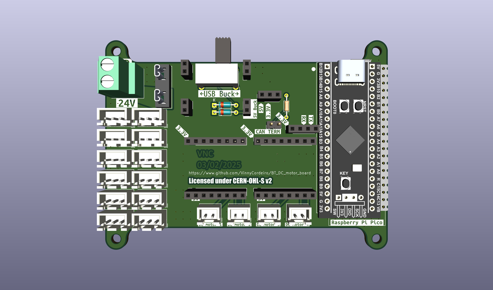

# BoxTurtle DC motors standalone board
A standalone board to control the DC motors of the BoxTurtle.

IMPORTANT NOTE: this design is still untested and being modified frequently as bugs/flaws are found. Do not order PCBs yet until we say it's safe!

## Why
The [AFC-Lite](https://github.com/xbst/AFC-Lite) is the preferred board for the BoxTurtle, but it is quite expensive and is only available on xbst's store (which is fair). However, many of us (myself included) already have a stash of old 3D printer controller boards to take care of the stepper motors, so only the DC motors were left without a standalone solution to control them. This board is an attempt to solve this situation.

I designed the board to be as easy and cheap possible; with that in mind, here are the design constraints:
- All components/modules must be through hole mounted: I have professional training in electronics and the tools so SMD isn't a problem, but this isn't true for most of the hobbyists; by using through hole components the soldering complexity barrier is lowered;
- All modules are to be mounted on sockets: this opens some space on the board that would be otherwise unavailable. _DO NOT_ solder the modules directly on the board: not only you'll ruin the modularity of the design, you won't be able to install the power selection circuitry on the board (you may get away by soldering wires at the bottom side of the board for the switch, and solder the diodes at the bottom, but that's a bodge and shouldn't be used);
- I added as much useful information on the board silkscreen as I could, with the exception of the pinout. This should help guiding how the components/modules must be mounted, so it's on you if you let the magic smoke out if mounting them the other way around.

## Bill of Materials
This board was made with modularity in mind, so you'll need to buy those modules from Aliexpress (or any other source as long as the footprint matches; if they don't, you'll need to modify the PCB yourself):
|Component|No. Needed|Comment|Sourcing URL|
|---------|----------|-------|-------|
|5.08mm Screw Terminal|1|Power Input|https://www.lcsc.com/product-detail/Screw-span-style-background-color-ff0-terminal-span_MAX-MX129-5-08-02P-GN01-Cu-Y-A_C5188485.html|
|Automotive Mini-Blade Fuse Holder|1|Takes [Mini Automotive Fuses](https://www.keyelco.com/product.cfm/product_id/1376)|https://www.lcsc.com/product-detail/Fuse-Holders_XFCN-XF-506P_C492610.html|
|10A Mini Automotive fuse|1|For circuit safety|https://www.lcsc.com/product-detail/Automotive-Fuses_Littelfuse-0297010-WXNV_C151094.html|
|DC-DC 3A buck converter|1|Pick the 5V version|https://www.aliexpress.com/item/1005007031557776.html|
|LDO 800MA DC 5V to 3.3V buck converter|1|They come with right angle pin headers, you have to swap for straight pins|https://www.aliexpress.com/item/1005007792706354.html|
|DRV8837 2 Way DC H-Bridge|2|Pick the version with 2 drivers on the board|https://www.aliexpress.com/item/1005007587993921.html|
|SN65HVD230 CAN Network Transceiver Board|1|Optional, only if CAN bus will be used. You may need a jumper for the termination resistor if this is at the end of the CAN bus|https://www.aliexpress.com/item/1005006438437964.html|
|Jumper|1|If you doesn't have one|https://www.lcsc.com/product-detail/Shunts-Jumpers_TE-Connectivity-2-881545-2_C5166780.html|
|Pin socket 2 pins|4|For the 5V buck converter module|https://www.lcsc.com/product-detail/Female-Headers_BOOMELE-Boom-Precision-Elec-2-54-1-2P_C49661.html|
|Pin socket 3 pins|1|For the 3.3V buck converter module|https://www.lcsc.com/product-detail/Female-Headers_BOOMELE-Boom-Precision-Elec-2-54-1-3P_C146243.html|
|Pin socket 4 pins|1|For the CAN transceiver module|https://www.lcsc.com/product-detail/Female-Headers_BOOMELE-Boom-Precision-Elec-2-54-1-4P_C2718488.html|
|Pin socket 8 pins|4|For the DRV8837 modules|https://www.lcsc.com/product-detail/Female-Headers_BOOMELE-Boom-Precision-Elec-2-54-1-8P_C27438.html|
|Pin socket 20 pins|2|For the MCU|https://www.lcsc.com/product-detail/Female-Headers_Megastar-ZX-PM2-54-1-20PY_C7499336.html|
|Pin header|1|Only needed if using CAN bus _and_ this will be the last device on it|https://www.lcsc.com/product-detail/Pin-Headers_XFCN-PZ254V-11-02P_C492401.html|
|Schottky diode|2|You can reallistically use whatever through hole Schottky diode you have, even the BAT85 that used to be used on magnetic probes on old VORON releases|https://www.lcsc.com/product-detail/Schottky-Diodes_STMicroelectronics-BAT48_C283476.html|
|120 ohms resistor|1|Only needed if using CAN bus _and_ this will be the last device on it|https://www.lcsc.com/product-detail/Through-Hole-Resistors_Vishay-Intertech-MBB02070C1200FCT00_C1364429.html|
|Switch|1|For selecting USB ou buck converter power|https://www.lcsc.com/product-detail/Slide-Switches_E-Switch-EG1224_C273395.html|
|Raspberry Pi Pico, or...|1|MCU (Pick one)|https://www.aliexpress.com/item/1005003708090298.html|
|STM32F401 BlackPill|1|MCU (Pick one)|https://www.aliexpress.com/item/1005006127461676.html|

## Attributions
- Apex Mk2 Font Family by Jeremy Nelson, licensed under the 1001Fonts Free For Commercial Use License (FFC); obtained at https://www.1001fonts.com/apex-mk2-font.html
- Raspberry Pi Pico STEP file made by Raspberry Pi Foundation; obtained at https://datasheets.raspberrypi.com/pico/Pico-R3-step.zip
- Blackpill STM32F401CCU6 STEP model made by Adam Valent, published on GrabCAD by user Zawisza on August 22nd, 2022; obtained at https://grabcad.com/library/blackpill-stm32f401ccu6-1
- Mini Automotive fuse STEP model by Littelfuse, Inc.; obtained at https://www.littelfuse.com/products/fuses-overcurrent-protection/fuses/automotive-fuses/blade-fuses-shunt/mini/297/0297010-u

## Acknowledgements
- [Robert Klotz](https://github.com/ArmoredTurtle), for creating the amazing BoxTurtle project (I'm anxiously awaiting for the 8-Track!);
- [xbst](https://github.com/xbst), for designing the AFC-Lite. While the design files aren't available as I write, the schematics is public so I used them to create this board as well. Also, his mild distaste for the RP2040 MCUs on Klipper projects made me add support for a STM32 MCU board as well, which leads to;
- comradef191 and their [NyoomiesKME board](https://github.com/comradef191/NyoomiesKME), for the idea of adding support for both the Raspberry Pi Pico and the Black Pill STM32F401 MCU modules;
- Sanity Agathion on the [VORON Discord server](https://discord.gg/voron), for the tip that made me add the CAN bus module support;
- [timmit99](https://github.com/timmit99/) and [Shammy](https://xrbunker.works), both also from the VORON Discord server, for the support and also for providing a 3D model for the fuse holder (just catch the ball next time, timmit99!);
- and [clee](https://github.com/clee): you know what you did.

## LICENSE
This source describes Open Hardware and is licensed under the CERN-OHL-S v2 or any later version.
You may redistribute and modify this source and make products using it under the terms of the CERN-OHL-S v2. (https://ohwr.org/cern_ohl_s_v2.txt)

This source is distributed WITHOUT ANY EXPRESS OR IMPLIED WARRANTY, INCLUDING OF MERCHANTABILITY, SATISFACTORY QUALITY AND FITNESS FOR A PARTICULAR PURPOSE. Please see the CERN-OHL-S v2 for applicable conditions.

Source location: https://github.com/VinnyCordeiro/BT_DC_motor_board

As per CERN-OHL-S v2 section 4, should You produce hardware based on this source, You must where practicable maintain the Source Location visible on the PCB.
